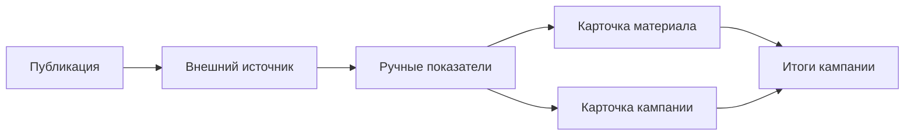

В первой версии MarketingOS аналитика помогает вручную зафиксировать результаты материалов и кампаний.

Показатели вносятся в карточки материалов или кампаний. Так команда сохраняет не только факт публикации, но и результат: просмотры, переходы, заявки, реакции, комментарии или другие данные из внешних источников.

> Место для скриншота: блок показателей в карточке материала или кампании.

## Что входит в базовую аналитику

В первой версии можно учитывать:

- количество заявок на контент;
- количество материалов в производстве;
- количество опубликованных материалов;
- выполнение сроков;
- просроченные задачи;
- базовые показатели по материалам;
- итоговые выводы по кампании.

## Как фиксируются данные

Данные нужно получить из внешнего источника и внести в MarketingOS вручную.

Источником может быть сайт, рекламный кабинет, рассылка, социальная сеть, отчёт подрядчика или другой канал, который использует команда.

## Какие есть ограничения

В первой версии нет сквозной аналитики, аналитических панелей и автоматической интеграции с рекламными кабинетами.

Это значит, что MarketingOS не собирает показатели автоматически. Система помогает сохранить данные в контексте кампании и использовать их при подведении итогов.

## Что важно фиксировать кроме цифр

Добавляйте короткий вывод: что сработало, где были задержки, какие данные стоит проверить в следующий раз.

Так аналитика будет полезна не только для отчёта, но и для планирования следующих кампаний.

## Что делать дальше

1. [Зафиксируйте ручные показатели](/analytics/02-manual-metrics).
2. [Подведите итог кампании](/analytics/03-campaign-summary).
3. [Завершите кампанию](/campaigns/04-close-campaign).
