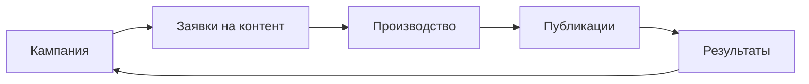

Кампания — это верхний уровень планирования в MarketingOS. В ней команда собирает цель, сроки, заявки на контент, материалы, публикации и результаты.

Создавайте кампанию, когда нужно управлять не одним материалом, а связанной маркетинговой активностью: запуском продукта, рассылкой, серией публикаций, мероприятием или рекламной активностью.

> Место для скриншота: список кампаний или карточка кампании.

## Что хранится в кампании

В кампании фиксируются основные данные, которые помогают управлять работой:

- цель;
- период;
- ответственный;
- связанные заявки на контент;
- материалы в производстве;
- публикации;
- базовые показатели;
- выводы по результатам.

Не используйте кампанию только как папку для материалов. Без цели, срока и ответственного руководителю будет сложнее понять, зачем ведётся работа и когда её нужно завершить.

## Как кампания связана с контентом

Кампания задаёт общий контекст. Заявки помогают поставить задачи на материалы. Производство помогает довести материалы до публикации. Аналитика помогает сохранить результат.

## Когда кампания помогает

Кампания полезна, если нужно:

- запланировать несколько связанных материалов;
- назначить ответственных;
- контролировать сроки;
- видеть, какие материалы уже опубликованы;
- зафиксировать результаты и выводы.

Если нужно подготовить один разовый материал без связи с общей маркетинговой активностью, начните с заявки на контент.

## Что делать дальше

1. [Создайте кампанию](/campaigns/02-create-campaign).
2. [Добавьте заявку на контент](/requests/02-create-request).
3. [Контролируйте кампанию](/campaigns/03-control-campaign).
4. [Завершите кампанию](/campaigns/04-close-campaign).
