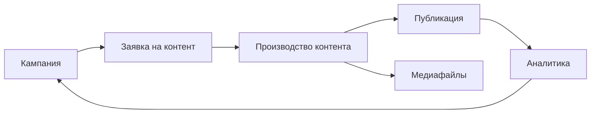

База знаний помогает быстро найти нужную инструкцию по MarketingOS: от первого запуска до кампаний, контента, медиафайлов, аналитики и администрирования.

Выберите задачу, с которой пришли, и перейдите в нужный раздел.

## Если вы впервые открыли MarketingOS

Начните с короткого знакомства и первого тестового сценария.

1. [Что такое MarketingOS и что появится после установки](/quick-start/01-what-is-marketingos)
2. [Первый сценарий: от кампании до результата](/quick-start/03-first-scenario)

## Если хотите запланировать маркетинговую активность

Откройте раздел про кампании. Он поможет создать кампанию, связать её с материалами, контролировать работу и подвести итог.

- [Кампании: как устроена работа](/campaigns/01-overview)
- [Как создать кампанию](/campaigns/02-create-campaign)
- [Как контролировать кампанию](/campaigns/03-control-campaign)
- [Как завершить кампанию](/campaigns/04-close-campaign)

## Если нужно поставить задачу на материал

Используйте заявки на контент. Заявка помогает зафиксировать цель, формат, аудиторию, срок, требования и связь с кампанией до запуска производства.

- [Заявки на контент: как устроена работа](/requests/01-overview)
- [Как создать заявку на контент](/requests/02-create-request)
- [Как проверить заявку перед производством](/requests/03-review-request)

## Если материал уже нужно готовить к публикации

Откройте раздел про производство контента. Он помогает передать материал в работу, обновлять статусы и зафиксировать публикацию.

- [Производство контента: как устроена работа](/production/01-overview)
- [Как запустить материал в производство](/production/02-start-production)
- [Как использовать статусы](/production/03-use-statuses)
- [Как зафиксировать публикацию и результат](/production/04-fix-publication-results)

## Если работаете с файлами и правами использования

Раздел «Медиафайлы» помогает учитывать изображения, видео, документы, исходники и материалы подрядчиков.

Он также помогает фиксировать источник, условия использования и срок действия прав, чтобы снизить риск претензий по материалам.

- [Медиафайлы: как устроена работа](/mediafiles/01-overview)
- [Как добавить медиафайл](/mediafiles/02-add-mediafile)
- [Как учитывать условия использования](/mediafiles/03-usage-rights)

## Если нужно сохранить результаты

Раздел «Аналитика» помогает вручную внести показатели, сохранить выводы и использовать результаты при планировании следующих кампаний.

- [Аналитика: как устроена работа](/analytics/01-overview)
- [Как фиксировать ручные показатели](/analytics/02-manual-metrics)
- [Как подвести итог кампании](/analytics/03-campaign-summary)

## Если вы отвечаете за установку и настройку

Откройте раздел администрирования. Он написан для администратора, который может не быть техническим специалистом, но отвечает за установку, права и базовую проверку приложения.

- [Установка приложения](/admin/01-installation)
- [Первоначальная настройка](/admin/02-initial-setup)
- [Повторная установка](/admin/03-reinstall)
- [Удаление приложения](/admin/04-uninstall)
- [Решение проблем](/admin/05-troubleshooting)

## Если нужен быстрый ответ или термин

- [Частые вопросы](/faq)
- [Глоссарий](/glossary/index)
- [Развитие системы](/system-development)

## Общая логика MarketingOS

