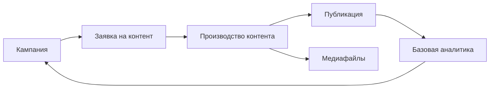

База знаний помогает освоить MarketingOS: сначала понять логику системы, затем пройти первый сценарий, потом углубиться в кампании, заявки, производство контента, медиафайлы, аналитику и администрирование.

## Как читать базу знаний

Если вы новый пользователь, идите по порядку:

1. **Быстрый старт** — понять, что устанавливает MarketingOS, и пройти первый сценарий.
2. **Кампании** — разобраться, как планировать маркетинговую работу на верхнем уровне.
3. **Заявки на контент** — научиться правильно запускать материалы в работу.
4. **Производство контента** — вести материал по стадиям от задачи до публикации.
5. **Медиафайлы** — учитывать материалы и условия их использования.
6. **Аналитика** — фиксировать результаты и выводы по кампаниям.
7. **Администрирование** — установка, первоначальная настройка, повторная установка, удаление и решение проблем.
8. **Развитие системы** — посмотреть, какие возможности есть в первой версии приложения и какие функциональные блоки планируются дальше.
9. **Глоссарий и поддержка** — быстро найти ответы на частые вопросы.

## Главные сущности системы

- **Кампания** — верхний уровень планирования. Объединяет цель, период, материалы и результат.
- **Заявка на контент** — вход в процесс производства. Фиксирует задачу, цель, аудиторию, требования и срок.
- **Производство контента** — рабочая воронка, в которой материал проходит подготовку, проверку, публикацию и фиксацию результата.
- **Медиафайл** — учёт файлов и условий использования: изображений, видео, документов и других материалов.

## Общая логика процесса

## Куда идти дальше

- Новый пользователь: [Первый сценарий](quick-start/03-first-scenario.md)
- Руководитель маркетинга: [Кампании](campaigns/01-overview.md)
- Участник контент-команды: [Производство контента](production/01-overview.md)
- Администратор: [Первоначальная настройка](admin/02-initial-setup.md)
- Если возникла проблема: [Решение проблем](admin/05-troubleshooting.md)
- Возможности следующих версий: [Развитие системы](system-development.md)

## Единая логика статей

Большинство инструкций в этой базе знаний построены по одной структуре:

- для чего нужна статья;
- когда использовать;
- что проверить перед началом;
- шаги;
- что проверить после выполнения;
- на что обратить внимание;
- результат;
- связанные статьи.
