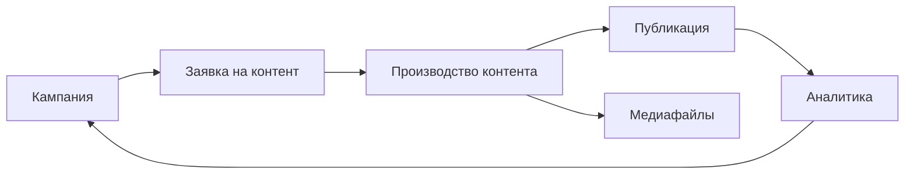

База знаний поможет начать работу с MarketingOS без долгого изучения системы.

Пройдите первый сценарий, создайте кампанию, запустите контент в работу, добавьте медиафайлы и зафиксируйте результат. Этого достаточно, чтобы понять основную логику приложения.

## Начните отсюда

Если вы открыли MarketingOS впервые, идите по этому маршруту:

1. Откройте [Первый сценарий](/quick-start/03-first-scenario).
2. Создайте первую кампанию.
3. Добавьте заявку на контент.
4. Проведите материал через производство.
5. Добавьте медиафайлы, если они нужны для публикации.
6. Зафиксируйте результат в аналитике.

После этого переходите к отдельным разделам.

## Что есть в MarketingOS

**Кампании**  
Помогают собрать маркетинговую активность в одном месте: цель, сроки, материалы, ответственных и результат.

[Перейти к кампаниям](/campaigns/01-overview)

**Заявки на контент**  
Помогают поставить задачу на материал: что нужно подготовить, для кого, к какому сроку и с какими требованиями.

[Перейти к заявкам на контент](/requests/01-overview)

**Производство контента**  
Помогает вести материал по стадиям: от задачи до публикации и фиксации результата.

[Перейти к производству контента](/production/01-overview)

**Медиафайлы**  
Помогают учитывать изображения, видео, документы и другие материалы, которые используются в контенте.

[Перейти к медиафайлам](/mediafiles/01-overview)

**Аналитика**  
Помогает зафиксировать базовые результаты кампании и сохранить выводы для следующих запусков.

[Перейти к аналитике](/analytics/01-overview)

## Как выглядит общий процесс

## Если вы администратор

Начните с установки и первоначальной настройки приложения:

— [Установка приложения](/admin/01-installation)  
— [Первоначальная настройка](/admin/02-initial-setup)  
— [Решение проблем](/admin/05-troubleshooting)

## Если хотите понять развитие продукта

Откройте раздел [Развитие системы](/system-development). В нём описано, что уже входит в первую версию и какие возможности могут появиться позже.
