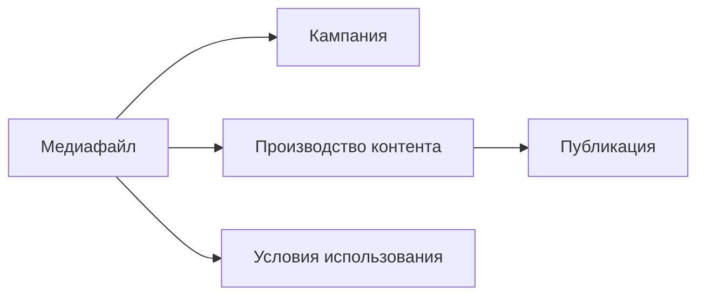

Медиафайлы помогают учитывать материалы, которые используются в кампаниях и контенте: изображения, видео, документы, презентации, исходники и материалы подрядчиков.

В карточке медиафайла команда фиксирует источник, тип материала, условия использования, срок действия прав и связи с кампаниями или материалами.

Такой учёт помогает не только быстрее находить файлы, но и снижать юридические риски: команда видит, откуда взят материал, где он используется и есть ли ограничения по повторному применению.

> Место для скриншота: список медиафайлов или карточка медиафайла.

## Что хранится в карточке медиафайла

В карточке обычно фиксируются:

- название;
- тип материала;
- источник;
- автор или поставщик, если применимо;
- условия использования;
- срок действия прав, если он есть;
- связь с кампанией;
- связь с материалом в производстве контента.

Если условия использования неизвестны, зафиксируйте это в карточке. Так команда увидит, что перед повторным использованием файла нужно уточнить права или источник.

## Зачем вести реестр лицензий и прав

Реестр помогает понять, какие материалы можно использовать повторно, а какие требуют проверки.

Это особенно важно для файлов от подрядчиков, стоковых изображений, видео, презентаций, исходников и материалов из открытых источников. Без учёта прав компания может случайно использовать материал вне разрешённых условий и получить претензию от правообладателя.

## Как медиафайлы связаны с процессом

Медиафайл может быть связан:

- с кампанией, если материал используется на уровне всей активности;
- с карточкой производства контента, если файл нужен для конкретного материала;
- с несколькими материалами, если файл используется повторно.

## Что проверить перед использованием

Перед использованием медиафайла проверьте:

- понятен ли источник;
- можно ли использовать материал;
- есть ли ограничения по сроку;
- есть ли ограничения по площадкам;
- связан ли файл с нужной кампанией или материалом.

## Что делать дальше

1. [Добавьте медиафайл](/mediafiles/02-add-mediafile).
2. [Зафиксируйте условия использования](/mediafiles/03-usage-rights).
3. [Свяжите файл с материалом в производстве](/production/01-overview).
