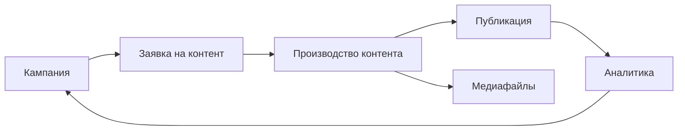

MarketingOS добавляет в Битрикс24 рабочее место для управления маркетингом.

После установки команда получает готовую структуру: кампании, заявки на контент, производство материалов, медиафайлы и базовую аналитику. Этого достаточно, чтобы начать вести маркетинговую работу в одном месте и не собирать процесс вручную с нуля.

> Место для скриншота: рабочее место MarketingOS в Битрикс24 после установки.

## Что появится после установки

В Битрикс24 появятся три основных раздела.

**Кампании**

Помогают планировать маркетинговую работу: цель, сроки, ответственные, материалы и результат.

**Контент**

Помогает запускать материалы в работу. Внутри есть два сценария: заявка на контент и производство контента.

**Медиафайлы**

Помогают учитывать изображения, видео, документы и другие материалы, которые используются в контенте.

## Как это связано

Кампания объединяет маркетинговую активность.

Заявка помогает поставить задачу на материал: что нужно подготовить, для кого, к какому сроку и с какими требованиями.

Производство помогает довести материал до публикации: назначить ответственных, контролировать статус и зафиксировать результат.

Медиафайлы помогают хранить материалы и условия их использования.

Аналитика помогает сохранить базовые показатели и выводы по кампании.

## Для кого

MarketingOS полезен, если маркетинговых задач стало больше, чем удобно вести в отдельных таблицах, чатах и задачах.

Основные пользователи — руководитель маркетинга, руководитель компании, маркетолог, редактор, копирайтер, дизайнер и подрядчик, который участвует в подготовке материалов.

## Что можно сделать в первой версии

После установки можно создать кампанию, добавить заявку на контент, запустить материал в производство, назначить ответственного, контролировать статус подготовки, добавить медиафайлы, вручную зафиксировать публикацию и внести базовые результаты.

## Чего пока нет в первой версии

MarketingOS не автоматизирует весь маркетинг полностью.

В первой версии нет автоматической публикации материалов, сквозной аналитики, аналитических панелей, интеграций с рекламными кабинетами и автоматической генерации контента.

Подробнее о развитии возможностей: [Развитие системы](/system-development).

## Что делать дальше

Перейдите к первому сценарию и создайте тестовую цепочку: кампания → заявка → производство → публикация → результат.

[Открыть первый сценарий](/quick-start/03-first-scenario)
