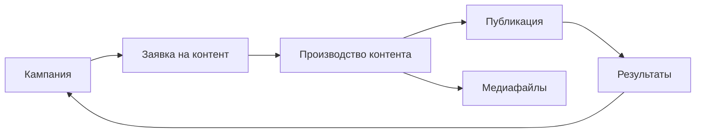

## Для чего эта статья

Статья помогает пройти первый рабочий сценарий в MarketingOS: создать кампанию, оформить заявку на контент, запустить материал в производство, зафиксировать публикацию и добавить базовые результаты.

## Когда использовать

Используйте инструкцию после установки приложения, если хотите быстро понять, как связаны основные части системы.

Для первого сценария выберите одну простую кампанию и один материал. Не переносите весь маркетинговый процесс компании сразу.

## Общая схема

## Перед началом

Определите:

- какую кампанию хотите запустить;
- какой материал нужно подготовить;
- кто будет ответственным;
- какой срок важен;
- какие результаты нужно будет зафиксировать после публикации.

## Шаг 1. Создайте кампанию

Откройте раздел «Кампании» и создайте новую кампанию.

Заполните основные поля:

- название кампании;
- цель;
- период;
- ответственный;
- описание.

Название должно быть понятным для команды. Например: «Запуск весенней рассылки» или «Контент-план на июнь».

> Место для скриншота: создание или карточка кампании.

## Шаг 2. Создайте заявку на контент

Откройте воронку «Заявка на контент» в смарт-процессе «Контент» и создайте заявку.

Заполните:

- название материала;
- цель;
- связь с кампанией;
- формат материала;
- аудиторию;
- срок;
- краткое описание задачи;
- требования к материалу, если они есть.

Заявка нужна, чтобы зафиксировать задачу до запуска производства. Так команда понимает, что нужно подготовить и зачем это нужно кампании.

> Место для скриншота: карточка заявки на контент.

## Шаг 3. Проверьте заявку

Перед запуском материала в производство проверьте, что в заявке достаточно данных.

Минимально должны быть понятны:

- цель материала;
- кампания, к которой он относится;
- формат;
- срок;
- ответственный или следующий участник процесса.

Если данных не хватает, дополните заявку до передачи в производство.

## Шаг 4. Запустите производство контента

После проверки заявки переведите материал в воронку «Производство контента» или создайте связанную карточку производства, если это предусмотрено вашей конфигурацией.

Проверьте, что в карточке производства указаны:

- связь с заявкой;
- связь с кампанией;
- название материала;
- формат;
- ответственный;
- срок;
- текущий статус.

> Место для скриншота: карточка производства контента.

## Шаг 5. Добавьте медиафайлы, если они нужны

Если для материала используются изображения, видео, документы или другие файлы, добавьте их в раздел «Медиафайлы».

В карточке медиафайла укажите:

- название;
- тип материала;
- источник;
- условия использования;
- связь с материалом или кампанией.

Если для первого сценария медиафайлы не нужны, этот шаг можно пропустить.

## Шаг 6. Ведите материал по статусам

Обновляйте статус карточки по мере движения работы.

Обычно в процессе нужно понимать:

- что взято в работу;
- что готовится;
- что передано на проверку;
- что готово к публикации;
- что опубликовано;
- что завершено.

Точная логика статусов зависит от установленной версии конфигурации.

> Место для скриншота: список материалов по статусам или карточка со статусом.

## Шаг 7. Зафиксируйте публикацию

После публикации материала внесите в карточку данные о публикации.

Например:

- дату публикации;
- канал публикации;
- ссылку на опубликованный материал;
- комментарий, если он нужен команде.

В первой версии MarketingOS не публикует материалы автоматически. Публикация фиксируется вручную.

## Шаг 8. Добавьте базовые результаты

Когда появились первые показатели, внесите их в карточку материала или кампании.

Например:

- просмотры;
- переходы;
- заявки;
- реакции;
- другие показатели, которые использует ваша команда.

Если точных данных пока нет, вернитесь к этому шагу позже.

## Шаг 9. Завершите кампанию

Когда материал опубликован и результаты зафиксированы, завершите кампанию или оставьте её в работе, если по ней готовятся другие материалы.

Перед завершением проверьте:

- связана ли заявка с кампанией;
- связан ли материал в производстве с заявкой и кампанией;
- указаны ли публикация и результат;
- зафиксированы ли выводы.

## Что проверить после выполнения

После первого сценария проверьте, что в системе есть:

- одна кампания;
- одна заявка на контент;
- один материал в производстве;
- связь между кампанией, заявкой и производством;
- при необходимости — связанный медиафайл;
- отметка о публикации;
- базовый результат или место для его внесения.

## Пример

Кампания: «Запуск весенней рассылки»  
Заявка: «Письмо о новой услуге»  
Производство: «Подготовка письма для рассылки»  
Публикация: отправка письма по базе клиентов  
Результат: количество переходов и заявок после рассылки

## На что обратить внимание

### Не пропускайте заявку

Заявка помогает правильно поставить задачу до начала производства. Если сразу создавать материал в производстве, можно потерять контекст: цель, аудиторию, требования и связь с кампанией.

### Проверяйте связи

Кампания, заявка и производство должны быть связаны между собой. Иначе руководителю будет сложнее увидеть полную картину по кампании.

### Обновляйте статусы

Статусы показывают текущее состояние работы. Если их не обновлять, процесс станет менее прозрачным для команды.

### Фиксируйте результат

Даже базовый ручной показатель лучше, чем отсутствие результата. Он помогает оценить кампанию и подготовить следующий цикл работы.

## Результат

После прохождения сценария пользователь понимает основную логику MarketingOS и может выполнить базовые действия без постоянных подсказок.

## Связанные статьи

- [Кампании](/campaigns/01-overview)
- [Заявки на контент](/requests/01-overview)
- [Производство контента](/production/01-overview)
- [Медиафайлы](/mediafiles/01-overview)
