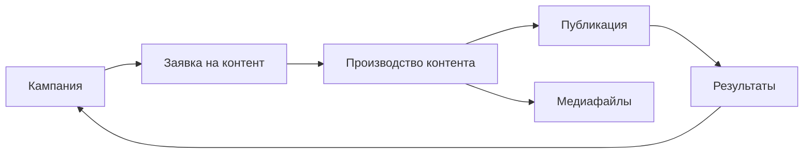

Пройдите первый сценарий, чтобы быстро понять основную логику MarketingOS: кампания → заявка на контент → производство → публикация → результат.

Для первого запуска выберите одну простую кампанию и один материал. Не переносите весь маркетинговый процесс компании сразу.

## Перед началом

Подготовьте:

- название кампании;
- один материал, который нужно подготовить;
- ответственного;
- срок;
- результат, который нужно будет зафиксировать после публикации.

## Шаг 1. Создайте кампанию

Откройте раздел «Кампании» и создайте новую кампанию.

Заполните название, цель, период, ответственного и описание.

Название должно быть понятным для команды. Например: «Запуск весенней рассылки» или «Контент-план на июнь».

<Frame>
  
</Frame>

## Шаг 2. Создайте заявку на контент

Откройте воронку «Заявка на контент» в смарт-процессе «Контент» и создайте заявку.

Укажите название материала, цель, связь с кампанией, формат, аудиторию, срок, краткое описание задачи и требования к материалу, если они есть.

> Место для скриншота: карточка заявки на контент.

## Шаг 3. Проверьте заявку

Перед запуском материала в производство проверьте, что в заявке достаточно данных.

Минимально должны быть понятны:

- цель материала;
- кампания, к которой он относится;
- формат;
- срок;
- ответственный или следующий участник процесса.

Если данных не хватает, дополните заявку до передачи в производство.

## Шаг 4. Запустите производство контента

После проверки заявки переведите материал в воронку «Производство контента» или создайте связанную карточку производства, если это предусмотрено вашей конфигурацией.

Проверьте, что в карточке производства указаны связь с заявкой, связь с кампанией, название материала, формат, ответственный, срок и текущий статус.

> Место для скриншота: карточка производства контента.

## Шаг 5. Добавьте медиафайлы, если они нужны

Если для материала используются изображения, видео, документы или другие файлы, добавьте их в раздел «Медиафайлы».

В карточке медиафайла укажите название, тип материала, источник, условия использования и связь с материалом или кампанией.

Если для первого сценария медиафайлы не нужны, пропустите этот шаг.

## Шаг 6. Ведите материал по статусам

Обновляйте статус карточки по мере движения работы.

Статус должен показывать, что происходит с материалом сейчас: он взят в работу, готовится, проверяется, готовится к публикации, опубликован или завершён.

Точная логика статусов зависит от установленной версии конфигурации.

> Место для скриншота: список материалов по статусам или карточка со статусом.

## Шаг 7. Зафиксируйте публикацию

После публикации материала внесите в карточку дату публикации, канал, ссылку на опубликованный материал и комментарий, если он нужен команде.

В первой версии MarketingOS не публикует материалы автоматически. Публикация фиксируется вручную.

## Шаг 8. Добавьте базовые результаты

Когда появились первые показатели, внесите их в карточку материала или кампании.

Это могут быть просмотры, переходы, заявки, реакции или другие показатели, которые использует ваша команда.

Если точных данных пока нет, вернитесь к этому шагу позже.

## Шаг 9. Завершите кампанию

Когда материал опубликован и результаты зафиксированы, завершите кампанию или оставьте её в работе, если по ней готовятся другие материалы.

Перед завершением проверьте:

- заявка связана с кампанией;
- материал в производстве связан с заявкой и кампанией;
- публикация и результат указаны;
- выводы зафиксированы.

## Что проверить

После первого сценария в системе должны быть:

- одна кампания;
- одна заявка на контент;
- один материал в производстве;
- связь между кампанией, заявкой и производством;
- связанный медиафайл, если он нужен;
- отметка о публикации;
- базовый результат или место для его внесения.

## Пример

Кампания: «Запуск весенней рассылки».

Заявка: «Письмо о новой услуге».

Производство: «Подготовка письма для рассылки».

Публикация: отправка письма по базе клиентов.

Результат: количество переходов и заявок после рассылки.

## Частые ошибки

### Пропустить заявку

Заявка помогает поставить задачу до начала производства. Если сразу создать материал в производстве, можно потерять контекст: цель, аудиторию, требования и связь с кампанией.

### Не связать карточки между собой

Кампания, заявка и производство должны быть связаны. Иначе руководителю будет сложнее увидеть полную картину по кампании.

### Не обновлять статусы

Статусы показывают текущее состояние работы. Если их не обновлять, процесс становится менее прозрачным для команды.

### Не фиксировать результат

Даже базовый ручной показатель лучше, чем отсутствие результата. Он помогает оценить кампанию и подготовить следующий цикл работы.

## Связанные статьи

- [Кампании](/campaigns/01-overview)
- [Заявки на контент](/requests/01-overview)
- [Производство контента](/production/01-overview)
- [Медиафайлы](/mediafiles/01-overview)